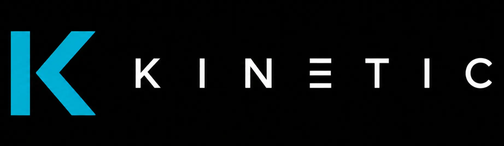

<div align="center">



### Kinetic - Movies App

Discover, rate and keep track of your favorite movies, with real-time data from TMDB and a personal ranking system.

[🚀 Live Demo](https://kinetic-movies-app.netlify.app/) <br>
Backend API: https://kinetic-backend-k6xv.onrender.com

> **Note**: the backend is hosted on Render's free tier, which spins down after periods of inactivity. The first request after some idle time may take 30-60 seconds to respond.


<br>


</div>

## Preview

### 🖥️ Desktop


### 📱 Mobile


## Core features

### Authentication

- Sign up / log in with email and password, or with Google
- Protected routes - content only accessible with an active session
- Password recovery via email

### Movie discovery

- Browse by category (popular, trending, top rated, now playing, upcoming)
- Search movies, actors and directors by text
- Filter by genre, year, language and minimum rating
- Pagination with "Load more", accumulating results

### Movie, actor and director detail pages

- Full movie sheet: synopsis, cast, director, genres, trailer, streaming availability
- Actor and director filmography, with cross-navigation between them
- Clear "not found" state for movies/people that don't exist, distinct from a real connection error

### Favorites and personal rating

- Mark/unmark any movie as favorite, with optimistic UI updates
- Rate movies 1–10 with a Letterboxd-style 5-star selector (each half-star = 1 point)
- Personalized `/favoritos` page, sortable by date added or TMDB rating

### Ranking

- Global Top 10 of Kinetic's community, aggregated across all users, sorted by average rating

### Profile

- Real stats: favorites count, rated movies count, and personal average rating (calculated from your own ratings)
- Avatar (from Google, if available), name, email, member-since date

## Tech stack

| Category           | Technology                                                                              |
| ------------------ | --------------------------------------------------------------------------------------- |
| Frontend framework | [React 18](https://react.dev/)                                                          |
| Language           | [TypeScript](https://www.typescriptlang.org/)                                           |
| Bundler            | [Vite](https://vitejs.dev/)                                                             |
| Styles             | [Tailwind CSS v4](https://tailwindcss.com/)                                             |
| Routing            | [React Router 7](https://reactrouter.com/)                                              |
| Backend framework  | [Express](https://expressjs.com/)                                                       |
| ORM                | [Prisma](https://www.prisma.io/)                                                        |
| Database           | [PostgreSQL](https://www.postgresql.org/) (hosted on [Supabase](https://supabase.com/)) |
| Authentication     | [Firebase Auth](https://firebase.google.com/products/auth) + Firebase Admin SDK         |
| External data      | [TMDB API](https://www.themoviedb.org/documentation/api) (proxied through the backend)  |
| Icons              | [Lucide React](https://lucide.dev/)                                                     |
| Testing            | [Vitest](https://vitest.dev/) + React Testing Library + Supertest                       |
| Version Control    | Git + GitHub (GitFlow)                                                                  |

## Getting started

### Prerequisites

- Node.js >= 20
- npm >= 9
- A [Firebase](https://firebase.google.com/) project with Email/Password and Google sign-in enabled
- A PostgreSQL database (recommended: [Supabase](https://supabase.com/), free tier)
- A [TMDB](https://www.themoviedb.org/settings/api) API key (free)

### 1. Clone the repository

```bash
git clone https://github.com/gemmaadev/kinetic-movies-app.git
cd kinetic-movies-app
```

### 2. Backend setup

```bash
cd backend
npm install
```

Create a `.env` file in `backend/`:

```env
TMDB_API_KEY=your_tmdb_api_key
TMDB_BASE_URL=https://api.themoviedb.org/3
PORT=8080
FIREBASE_SERVICE_ACCOUNT_PATH=./firebase-service-account.json
DATABASE_URL=your_postgres_connection_string
DIRECT_URL=your_postgres_direct_connection_string
```

Download your Firebase service account credentials (Project Settings → Service accounts → Generate new private key) and save the file as `backend/firebase-service-account.json`.

**Set up the database with Prisma:**

```bash
# Generate the Prisma client
npx prisma generate

# Apply existing migrations to your database
npx prisma migrate deploy
```

If you ever need to inspect or edit your data visually during development:

```bash
npx prisma studio
```

**Start the backend:**

```bash
npm run dev
```

The API will be available at `http://localhost:8080`.

### 3. Frontend setup

```bash
cd frontend
npm install
```

Create a `.env` file in `frontend/`:

```env
VITE_FIREBASE_API_KEY=
VITE_FIREBASE_AUTH_DOMAIN=
VITE_FIREBASE_PROJECT_ID=
VITE_FIREBASE_STORAGE_BUCKET=
VITE_FIREBASE_MESSAGING_SENDER_ID=
VITE_FIREBASE_APP_ID=
```

These values are found in your Firebase project settings, under "Your apps" > the web app's config object.

**Start the frontend:**

```bash
npm run dev
```

The app will be available at the URL shown in your terminal (typically `http://localhost:5173`).

## Testing

```bash
# Backend
cd backend
npm test

# Frontend
cd frontend
npm test
```

### Test coverage

| Category   | Frontend | Backend |
| ---------- | -------- | ------- |
| Statements | 88.56%   | 84.98%  |
| Branches   | 83.63%   | 77.2%   |
| Functions  | 82.92%   | 82.53%  |
| Lines      | 89.86%   | 85.13%  |

_Tests written following Gherkin scenarios (Given / When / Then) as comments above each test._

## Project structure

```
kinetic-movies-app/
├── backend/
│   └── src/
│       ├── app.ts                    # Express app setup, route mounting
│       ├── server.ts                 # Server entry point
│       ├── config/
│       │   └── db.ts                 # Prisma client instance
│       ├── middleware/
│       │   └── verifyFirebaseToken.ts # Auth middleware, attaches userId to requests
│       ├── shared/
│       │   ├── tmdbClient.ts         # TMDB API client, TmdbError class
│       │   └── firebaseAdmin.ts      # Firebase Admin SDK setup
│       └── features/
│           ├── auth/                 # Register/login sync with our own DB
│           ├── user/                 # User profile CRUD
│           ├── explore/              # Text search, filtered discovery
│           ├── person/               # Actor/director detail (TMDB proxy)
│           └── movie/
│               ├── movie.types.ts
│               ├── movie.routes.ts
│               ├── model/            # Prisma queries
│               │   ├── movie.model.ts        # Per-user: favorites, rating
│               │   └── movie-stats.model.ts  # Aggregations: global/personal ranking
│               └── controller/
│                   ├── movie.controller.ts           # TMDB proxy (popular, detail...)
│                   ├── movie.favorites.controller.ts # Favorites and rating CRUD
│                   └── movie-stats.controller.ts     # Ranking endpoints
│
└── frontend/
    └── src/
        ├── app/
        │   ├── layout/              # Layout, AuthLayout
        │   ├── router/              # Route definitions, ProtectedRoute
        │   └── providers/           # ErrorBoundary
        ├── pages/                   # Top-level pages (one per route)
        ├── shared/
        │   ├── components/          # Buttons, EmptyState, FormField, layout (NavBar, Footer)
        │   ├── hooks/               # useDebounce
        │   ├── services/            # apiClient (ApiError), firebase.ts
        │   └── utils/               # resizePosterUrl
        └── features/
            ├── auth/                 # AuthContext, AuthProvider, login/register hooks
            ├── explore/              # useExplore, MovieCard, MovieGrid, filters
            ├── movie/                # useMovieDetail, movie detail types
            ├── person/               # Shared PersonDetailPage, usePersonDetail
            ├── favorites/            # FavoritesContext, FavoriteButton, RatingInput, useRating
            └── stats/                # useRanking, useMyRanking
```

## Architecture decisions

- **Feature-based architecture** on both frontend and backend — each domain (auth, movie, favorites, explore, stats...) owns its components/hooks/types (frontend) or controllers/models (backend)
- **Frontend never calls TMDB directly** — all external requests go through the backend, which proxies and shapes the data
- **Data snapshotting for favorites/ratings** — when a movie is favorited or rated, its title/poster/rating are stored in our own database at that moment, instead of calling TMDB again on every read. This keeps `/favoritos` and the ranking pages fast (a couple of DB queries) and independent of TMDB's availability
- **404 vs. 502 distinction** — a `TmdbError`/`ApiError` class carries the real HTTP status code through the stack, so a movie/person that genuinely doesn't exist shows a clear "not found" message, separate from an actual connection failure
- **Global auth/favorites state via React Context** — `AuthContext` and `FavoritesContext` avoid prop-drilling and keep a single source of truth for session state and favorite movie ids across the whole app
- **Optimistic UI updates** — marking a favorite or rating a movie updates the UI instantly, reverting automatically if the backend call fails
- **Single toggle endpoint for favorites** — one `POST /api/movie/favorites` flips the favorite status, instead of separate `POST`/`DELETE` endpoints, keeping the client-side logic simpler
- **Server-side aggregation for the ranking** — the global Top 10 is computed with a single `groupBy` query (average rating, count, ordered) plus one lookup for poster/title, rather than fetching and aggregating in the client
- **URL-driven filters and search on Explore** — search term, category, and filters live in `useSearchParams`, not local component state, so a search is shareable and preserved on back-navigation
- **Debounced search input** — text search is debounced (400ms) before triggering a request, avoiding a network call on every keystroke
- **Split test types** — most tests are unit tests with mocked dependencies; the ranking aggregation queries (`groupBy`, averages) are tested as integration tests against a real database, since mocking Prisma's aggregation behavior would test the mock, not the actual SQL logic
- **Accessibility as a first-class concern** — semantic HTML applied consciously throughout the codebase, only where it genuinely reflects the content's structure rather than as a blanket replacement for generic elements; `aria-label` added to icon-only buttons and grouped links; verified with Lighthouse across all pages (92–94% accessibility score)
- **Performance-conscious images** — explicit `width`/`height` to avoid layout shift, static assets converted to WebP, TMDB images requested at the smallest size needed. Verified with Lighthouse: 90–100% Performance, 0 CLS

## Author

**Gemma Maeso** · [@gemmaadev](https://github.com/gemmaadev)

Project developed as part of the **IT Academy** program by Barcelona Activa
